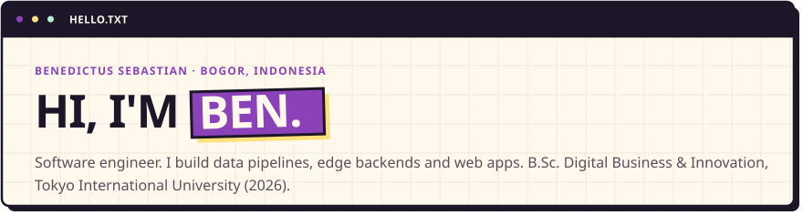
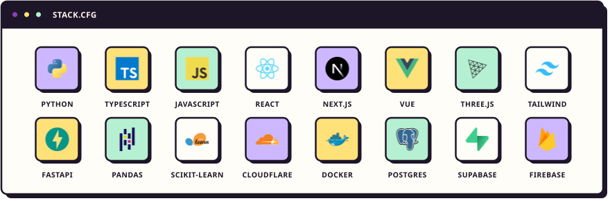

<!-- Panels are drawn by scripts/build.py (static) and scripts/stats.py (twice a day, via Actions). -->

<a href="https://conradium.my.id"><picture><source media="(prefers-color-scheme: dark)" srcset="assets/intro-dark.svg"></picture></a>

<picture><source media="(prefers-color-scheme: dark)" srcset="assets/stack-dark.svg"></picture>

<picture><source media="(prefers-color-scheme: dark)" srcset="https://raw.githubusercontent.com/Conradium/Conradium/output/stats-dark.svg"></picture>

<picture><source media="(prefers-color-scheme: dark)" srcset="https://raw.githubusercontent.com/Conradium/Conradium/output/snake-dark.svg"></picture>
