<!-- Panels are drawn by scripts/build.py (static) and scripts/stats.py (daily, via Actions). -->

<a href="https://conradium.my.id"><picture><source media="(prefers-color-scheme: dark)" srcset="assets/hero-dark.svg"></picture></a>

 

<picture><source media="(prefers-color-scheme: dark)" srcset="assets/head-work-dark.svg">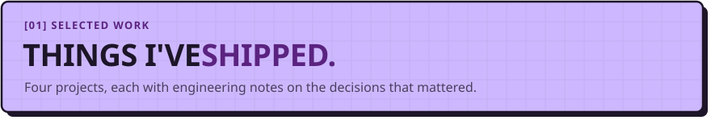</picture>

<a href="https://himotoki.web.app/"><picture><source media="(prefers-color-scheme: dark)" srcset="assets/work-himotoki-dark.svg">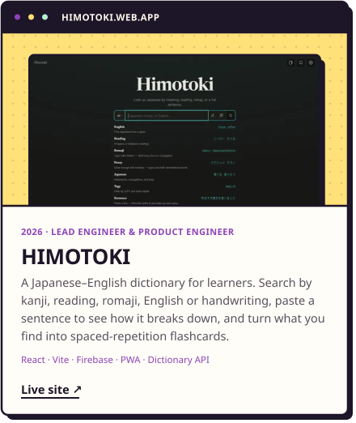</picture></a><a href="https://snacktrack.conradium.my.id"><picture><source media="(prefers-color-scheme: dark)" srcset="assets/work-snacktrack-dark.svg">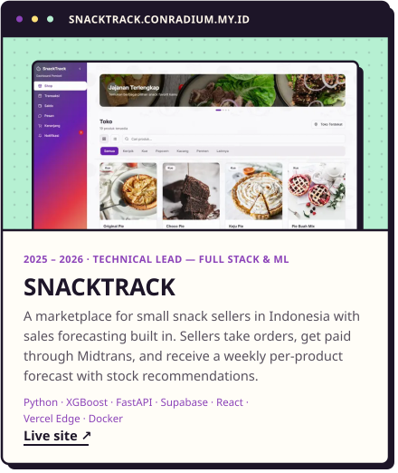</picture></a>

<a href="https://aimflicks-beta.vercel.app"><picture><source media="(prefers-color-scheme: dark)" srcset="assets/work-aimflicks-dark.svg">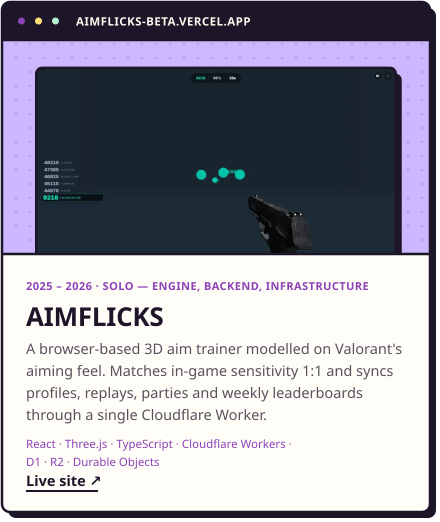</picture></a><a href="https://conradium.my.id/#work"><picture><source media="(prefers-color-scheme: dark)" srcset="assets/work-hirepassport-dark.svg">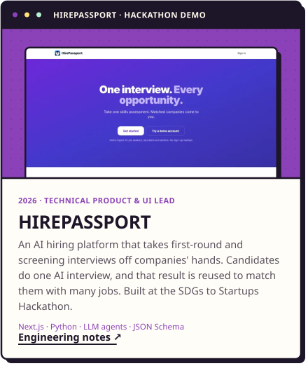</picture></a>

<a href="https://conradium.my.id/#work"><picture><source media="(prefers-color-scheme: dark)" srcset="assets/more-work-dark.svg">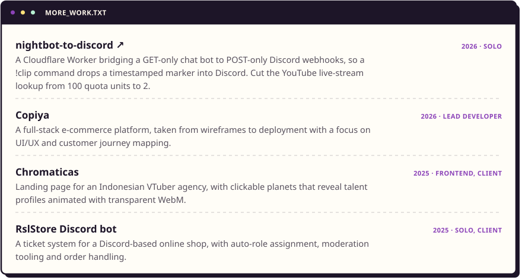</picture></a>

 

<picture><source media="(prefers-color-scheme: dark)" srcset="assets/head-toolbox-dark.svg">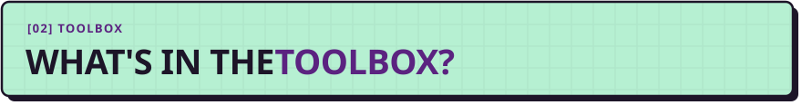</picture>

<picture><source media="(prefers-color-scheme: dark)" srcset="assets/toolbox-dark.svg">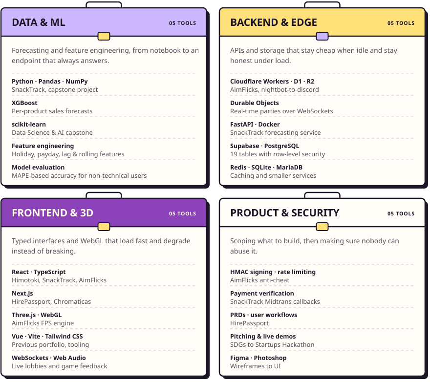</picture>

 

<picture><source media="(prefers-color-scheme: dark)" srcset="assets/head-activity-dark.svg">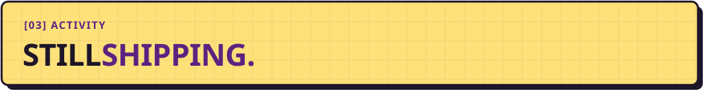</picture>

<picture><source media="(prefers-color-scheme: dark)" srcset="https://raw.githubusercontent.com/Conradium/Conradium/output/stats-dark.svg"></picture>

<picture><source media="(prefers-color-scheme: dark)" srcset="https://raw.githubusercontent.com/Conradium/Conradium/output/snake-dark.svg"></picture>

 

<a href="mailto:benedictus.sebastian5@gmail.com"><picture><source media="(prefers-color-scheme: dark)" srcset="assets/contact-dark.svg">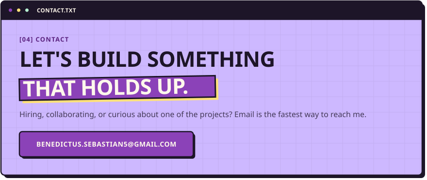</picture></a>

<a href="https://conradium.my.id"><picture><source media="(prefers-color-scheme: dark)" srcset="assets/btn-website-dark.svg"></picture></a><a href="https://www.linkedin.com/in/benedictus-sebastian-aria-pratama-205503333/"><picture><source media="(prefers-color-scheme: dark)" srcset="assets/btn-linkedin-dark.svg"></picture></a><a href="https://x.com/benedictus_seb"><picture><source media="(prefers-color-scheme: dark)" srcset="assets/btn-x-dark.svg">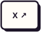</picture></a><a href="https://discord.com/users/326675937749893123"><picture><source media="(prefers-color-scheme: dark)" srcset="assets/btn-discord-dark.svg"></picture></a>

